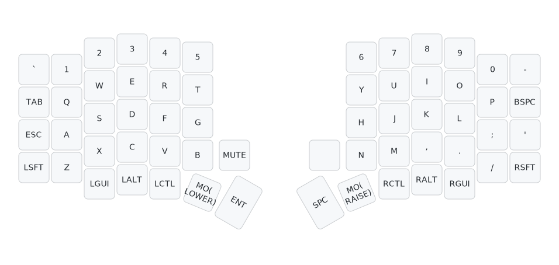
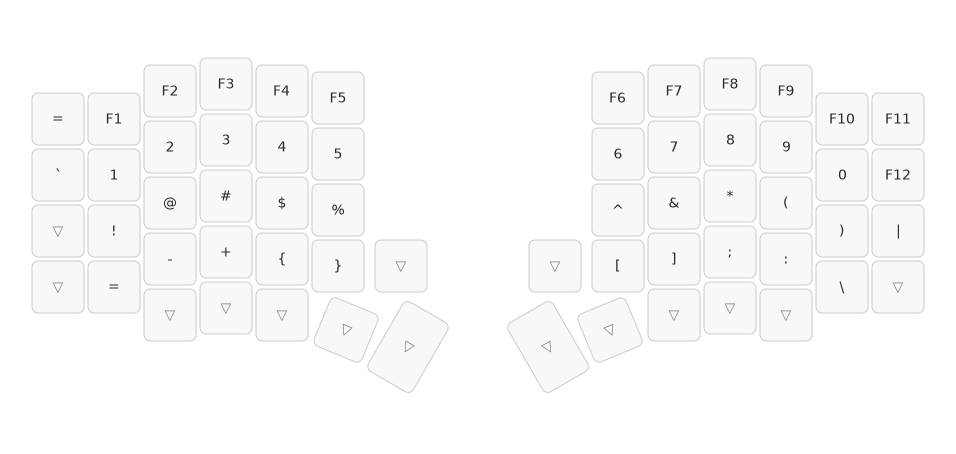
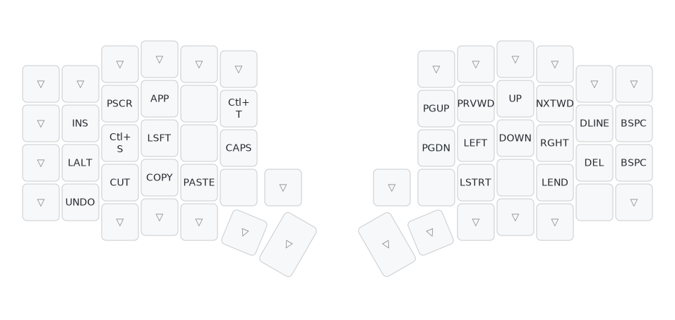
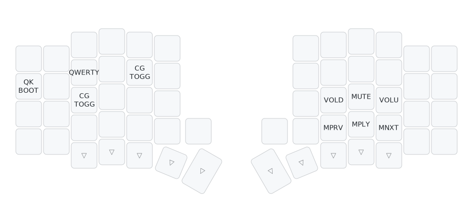
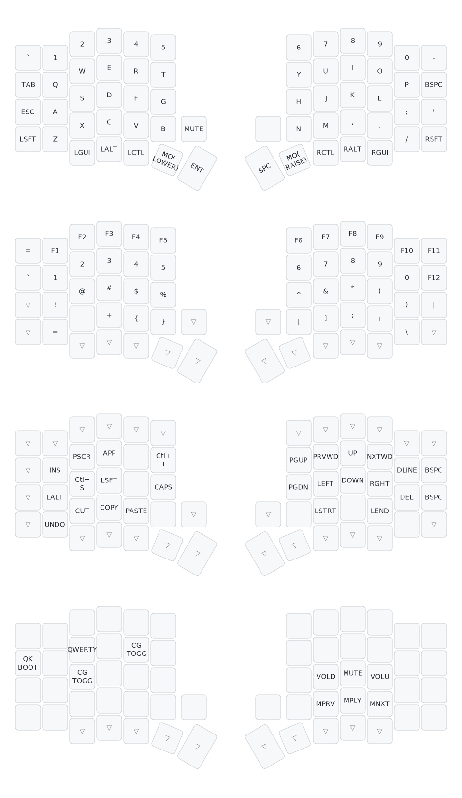

# Shubham's Sofle Keyboard Layout

A standard QMK configuration for the Sofle keyboard with QWERTY and Colemak support.


## Features

- Symmetric modifiers (CMD/Super, Alt/Opt, Ctrl, Shift)
- Support for both QWERTY and Colemak layouts
- Mac vs Linux/Win mode switching via CG_TOGG
- OLED displays showing layer status and mode
- Left encoder controls volume, right encoder for page navigation

## Layer Visualizations

### Base Layer (QWERTY)
*Primary typing layer with standard QWERTY layout*



### Lower Layer (Numbers & Symbols)
*Function keys, numbers, and primary symbols*



### Raise Layer (Navigation & Editing)
*Arrow keys, navigation, and text editing shortcuts*



### Adjust Layer (System & Media)
*System controls, media keys, and keyboard settings*



### Complete Keymap Overview
*All layers combined view*



## Build & Flash

```bash
# Build firmware
qmk compile -kb sofle/rev1 -km shubham030

# Flash both halves
qmk flash -kb sofle/rev1 -km shubham030
```

## OLED Display

- **Master (left)**: Shows current layer, layout mode (QWERTY/Colemak), OS mode (Mac/Win), and caps lock status
- **Slave (right)**: Shows QMK logo

## Encoder Functions

- **Left encoder**: Volume up/down
- **Right encoder**: Page up/down

---

**Note**: Keymap visualizations are automatically generated using [keymap-drawer](https://github.com/caksoylar/keymap-drawer).